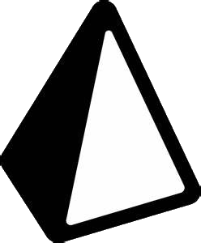

Hi 👋 My name is Mathijs
=====================

=====================

* 🌍  I'm based in Nederland, Limburg
* ✉️  You can contact me at [mathijsvanmelick3@gmail.com](mailto:mathijsvanmelick3@gmail.com)
* 🧠  I'm learning Software Development at Gildeopleidingen
<!--- * 🖥️  See my portfolio at [my website](http://mrdeurmat.dev/) --->

### Skills

 
 
 
 
 
 
 
 
 

### Socials

 
 
 
<!--  -->
  

### My GitHub Stats

 

 <!---
### Support Me

 --->
